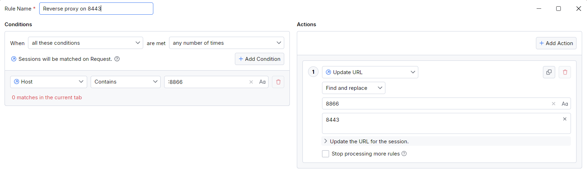

# Fiddler Everywhere as Reverse Proxy

A demo application used to test Fiddler Everywhere as a reverse proxy.

## Prerequisites

- [Node.js](https://nodejs.org) installed on your system.
- [Fiddler Everywhere](https://www.telerik.com/fiddler-everywhere) installed and configured.

## How to Clone the Repository

1. Open a terminal and navigate to the directory where you want to clone the repository.

2. Run the following command:
   ```bash
   git clone git@github.com:NickIliev/fiddler-reverse-demo.git
   ```

3. Navigate into the cloned repository:
   ```bash
   cd fiddler-reverse-demo
   ```

## How to Build and Run the Server

1. Install the dependencies:
   ```bash
   npm install
   ```
   
2. Start the server:
   ```bash
   node server.js
   ```
   The server will start on port `8443`.

## How to Build and Run the App

1. Ensure the server is running on `http://localhost:8443`.

2. Run the app:
   ```bash
   node app.js
   ```

At this point, the app works on port 8866 (instead of using the server's port), which we must configure in the reverese proxy rule in Fiddler Everywhere.

## Configuring Fiddler Everywhere as a Reverse Proxy

To configure Fiddler Everywhere as a reverse proxy, follow these steps:

1. **Update the application to use Fiddler's port**:

   Ensure that the application uses Fiddler's default port (`8866`) instead of the server's port (`8443`). For example:
   ```javascript
   xmlHttp.open("GET", 'http://localhost:8866/jsonData', false); // The application now uses Fiddler's port 8866
   ```

2. **Open Fiddler Everywhere**:
   - Go to the **Traffic** pane.
   - Open the **Rules** tab.

3. **Create a reverse proxy rule**:
   - Click **Add Rule**.
   - Create a rule to redirect all requests made to Fiddler's port (`8866`) to the server's original port (`8443`).

   Example rule:
   - **Match** a `Host` that contains `:8866`
   - **Action**: Find `:8866` and replace with `:8443`

   

4. **Enable the rule**:
   - Enable the newly created rule.
   - Ensure the **Rules** tab is enabled.

5. **Start the server**:
   - Start the server on its original port (`8443`):
     ```bash
     node server.js
     ```

6. **Execute the HTTP request**:
   - Run the application:
     ```bash
     node app.js
     ```
   - The request will be sent to Fiddler's port (`8866`), and Fiddler will forward it to the server's port (`8443`).

## Notes

- Ensure Fiddler Everywhere is running and capturing traffic on the specified port (`8866`).
- If you encounter issues, check the Fiddler Everywhere [documentation](https://docs.telerik.com/fiddler-everywhere/knowledge-base/fiddler-as-reverse-proxy) for troubleshooting tips.